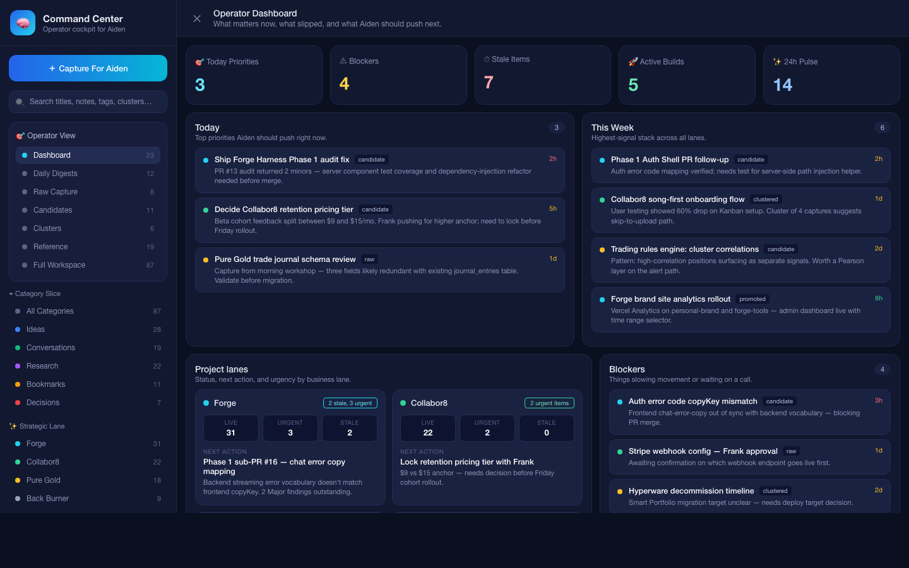

# Command Center



> A command space for your agent. You review exceptions, it does the rest.

Command Center is an opinionated workspace your AI agent drives on a schedule. Your agent captures, clusters, triages, promotes, and archives items through a defined state machine. You get a dashboard for inspecting exceptions, duplicates, and progress — not a manual inbox to clean.

It ships with a Next.js dashboard, a SQLite-backed store, a REST API, and an MCP server so agents can operate natively. Reference setups are included for [Hermes Agent](https://hermes-agent.nousresearch.com/docs/) and [OpenClaw](https://docs.openclaw.ai), both covering MCP registration plus cron-driven daily triage and weekly consolidation.

> This is a personal project I maintain on hobby time. Fork it, steal ideas, open issues — but there's no SLA. PRs welcome.

## ⚠ Security — read before deploying

Command Center has **no authentication** by design. It assumes you are the only caller. The default dev/start scripts bind to `127.0.0.1` so nothing outside your machine can reach the API.

**Do not expose this to a public network.** Running it on a public IP, or forwarding the port without auth in front, lets anyone on the internet read, modify, delete, and promote your captures — and trigger outbound webhook calls from your server.

For remote access, tunnel over SSH (`ssh -L 3005:localhost:3005 …`) or put it behind a reverse proxy that enforces auth (Caddy + basicauth, Tailscale, Cloudflare Access, etc.). Don't put captures you'd be uncomfortable sharing into the workspace — the promoted item's full `content` is sent to the webhook target.

## What it looks like

- **Dashboard** (`http://localhost:3005`): exception-first view of your workspace — today's priorities, blockers, stale items, lane status, pending decisions, waiting-on follow-ups, 24h pulse.
- **State machine**: every item flows `raw → clustered → candidate → promoted`, with `reference` and `archived` as terminal states.
- **Lanes**: items are sorted into configurable strategic lanes (Work / Personal / Later by default, or whatever you define).
- **Outcome loop**: agents can track owners, revisit dates, decisions needed, outcomes, evidence, supersession, and execution handoffs.
- **MCP tools**: `get_workspace`, `update_items`, `promote_items`, `scan_queue_noise`, and six more — all thin wrappers over the REST API so agents can read and write the whole workspace in one trip.

## Quickstart

```bash
git clone https://github.com/jendrypto/command-center.git
cd command-center

npm install
cp .env.example .env

# Edit command-space.config.ts to set your agent's name, lanes, and promotion target.
# Edit .env to set your webhook URL (if using the default webhook promotion).

npm run dev
```

Open `http://localhost:3005`. You'll see an empty dashboard.

## Wire your agent

Command Center is runtime-agnostic: MCP-aware agents can use the MCP server, and any agent can use the REST API. The examples folder includes two maintained references:

- [Hermes Agent](examples/hermes/README.md) — MCP registration with `hermes mcp add`, snippets for `AGENTS.md`/`TOOLS.md`, and `hermes cron create` jobs.
- [OpenClaw](examples/openclaw/README.md) — MCP registration with `openclaw mcp set`, snippets for workspace files, and `openclaw cron add` jobs.

### Hermes Agent

One-time setup for Hermes users — see [examples/hermes/README.md](examples/hermes/README.md) for the full walkthrough. Short version:

```bash
npm run mcp:build

./examples/hermes/install-mcp.sh

# Paste the Hermes snippets into your workspace
# (AGENTS.md, TOOLS.md)

./examples/hermes/install-daily-triage.sh
./examples/hermes/install-weekly-consolidation.sh
```

### OpenClaw

One-time setup for OpenClaw users — see [examples/openclaw/README.md](examples/openclaw/README.md) for the full walkthrough. Short version:

```bash
# Build the MCP server
npm run mcp:build

# Register it with openclaw
./examples/openclaw/install-mcp.sh

# Paste the three openclaw bootstrap snippets into your workspace
# (SOUL.md, AGENTS.md, TOOLS.md)

# Install the daily triage cron
./examples/openclaw/install-daily-triage.sh
./examples/openclaw/install-weekly-consolidation.sh
```

Your agent will run a triage pass every weekday morning. You open the dashboard to see what it did and what it kicked up for review.

## Wire a different agent

The MCP server speaks standard Model Context Protocol over stdio, so any MCP-aware client (Hermes, OpenClaw, Claude Desktop, Claude Code, Cursor, Zed, etc.) can use it. For non-MCP agents, the REST API at `/api/agent` is a straight JSON contract — see [HOWTO.md](HOWTO.md#custom-agents).

## Configuration

Edit `command-space.config.ts`. That file is the only per-install surface you control:

```ts
{
  agent: {
    name: "Scout",                // Shown in the dashboard
    purpose: "...",               // One-line description
  },
  focusAreas: [
    { id: "work", label: "Work", color: "#6c2bee", priority: 100 },
    // ...
  ],
  promotionTarget: {
    type: "webhook",              // or "none"
    url: process.env.PROMOTION_WEBHOOK_URL,
    headers: { Authorization: `Bearer ${process.env.PROMOTION_WEBHOOK_TOKEN}` },
  },
  dashboard: { title: "Command Center" },
}
```

States, dispositions, metadata fields, and the dashboard layout are product-level decisions and live in the code. If you need to change those, fork the repo. Everything else is config.

## State machine

```
   ┌─────┐   cluster    ┌───────────┐   surface    ┌───────────┐   promote   ┌──────────┐
──▶│ raw │─────────────▶│ clustered │─────────────▶│ candidate │────────────▶│ promoted │
   └──┬──┘              └─────┬─────┘              └─────┬─────┘             └──────────┘
      │                       │                          │
      │                       │                          └───▶ reference
      └──────────▶ archived ◀─┴──▶ archived
```

- `raw`: new capture, no classification yet
- `clustered`: tied to a theme via `cluster_key`
- `candidate`: needs human judgment or agent confidence is low
- `promoted`: pushed to an external system (via webhook or your chosen adapter)
- `reference`: kept but not action-driving
- `archived`: dead, merged duplicate, or resolved

## Agent metadata

The agent writes these fields on every triage pass. Your dashboard surfaces them.

| Field | Purpose |
|---|---|
| `reviewed_at` | When the agent last touched the item |
| `agent_confidence` | 0–1 confidence in the disposition |
| `disposition` | `keep_incubating`, `connect_cluster`, `promote`, `reference`, `archive`, `merge_duplicate` |
| `duplicate_of` | If this item is a duplicate, the canonical item's id |
| `cluster_key` | Free-form string grouping related items |
| `promotion_target` | Optional target label passed to the promotion adapter |
| `needs_review` | Boolean — set true when human judgment is needed |
| `attention_reason` | Short sentence explaining *why* it needs review |
| `focus_area` | Which lane this belongs to (from config) |
| `focus_score` | Priority score (derived from lane by default) |
| `owner` | Person/agent responsible for the next check |
| `revisit_at` | ISO datetime when the item should resurface |
| `decision_needed` | The unresolved question blocking closure |
| `outcome_status` | `open`, `decided`, `done`, `blocked`, `superseded`, or `dropped` |
| `outcome_note` | Human-readable result of the loop |
| `evidence` | Link, issue id, commit, note, or other proof |
| `superseded_by` | Item id that replaced this item |
| `execution_target` | Downstream queue/lane/run target |
| `execution_ref` | External ticket/run/reference id |
| `execution_url` | External ticket/run/reference URL |

## API contract

For full MCP/REST contracts see [HOWTO.md](HOWTO.md#api-contract). Quick reference:

- `GET /api/agent` — workspace snapshot (stats, active plan items, attention queue, duplicates, backlog, connections)
- `POST /api/agent` — batch updates/connections/disconnects/promotions in one call
- `GET /api/queue-cleaner` — noise report (duplicates, stale groups, heartbeat clutter, orphans)
- `POST /api/queue-cleaner` — cleanup actions
- `POST /api/promote` — promote a single item to the configured target

## Repo layout

```
command-center/
├── app/                 # Next.js dashboard + REST API
├── components/          # React UI
├── lib/                 # Core logic (db, config, promotion, queue-cleaner)
├── mcp-server/          # Stdio MCP server wrapping the REST API
├── examples/hermes/     # Drop-in bootstrap snippets + cron scripts for Hermes
├── examples/openclaw/   # Drop-in bootstrap snippets + cron scripts for OpenClaw
├── command-space.config.ts   # Per-install config (edit me)
├── .env.example
├── HOWTO.md             # Extending: adapters, agents, API
└── README.md            # You are here
```

## Extending

See [HOWTO.md](HOWTO.md):
- Writing a custom promotion adapter (Notion, Linear, your own system)
- Using Hermes, OpenClaw, or another agent runtime
- Using a raw REST contract
- Adding capture sources (browser, CLI, email-in)
- Customizing the dashboard

## License

MIT — see [LICENSE](LICENSE).
